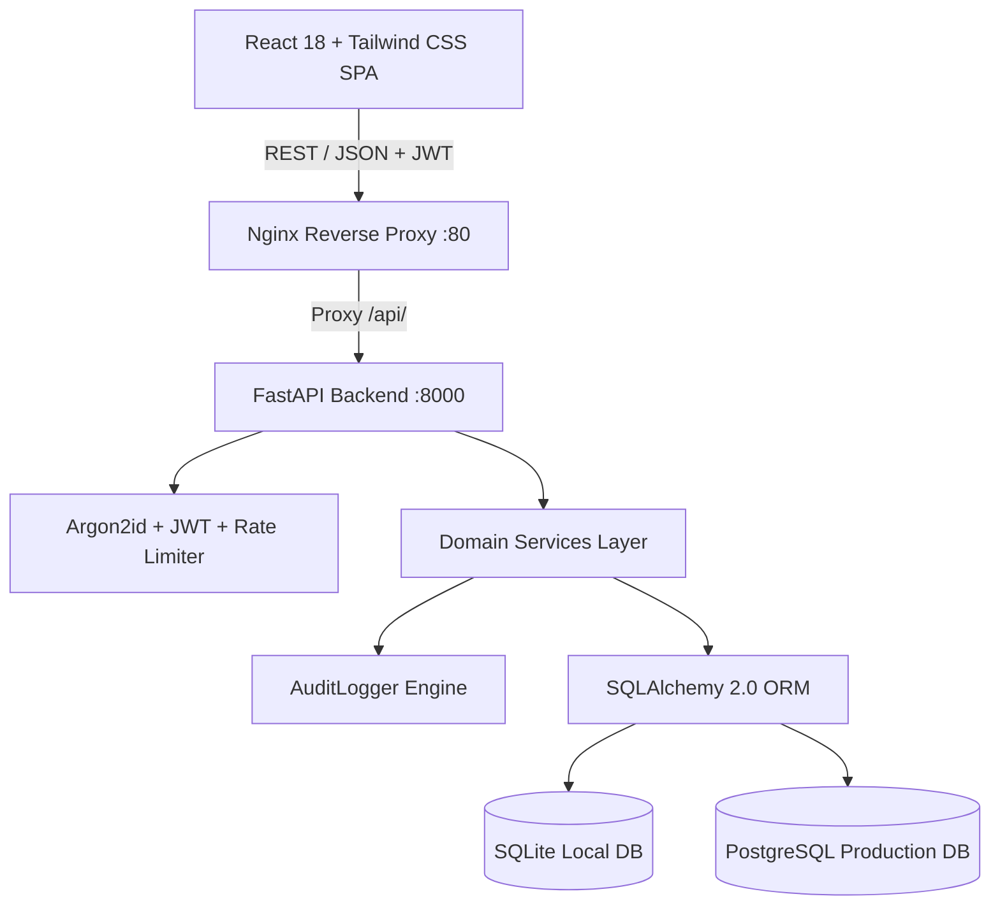

# 🏢 WorkforceHub — Enterprise Employee Attendance Management System

A complete, production-grade, secure, and audited **Employee Attendance Management System** built with **FastAPI (Python 3.13)**, **SQLAlchemy 2.0**, **PostgreSQL / SQLite**, and **React 18 (JSX + Vite + Tailwind CSS)**.

---

## 🌟 Key Features

### 1. 👥 Workforce & Employee Management
- **Centralized Directory**: Comprehensive employee lifecycle management with sequential employee code assignment (`EMP-0001`, `EMP-0002`...).
- **Department & Designation**: Organizational hierarchy mapping with active headcounts.
- **Lifecycle Statuses**: Manage `ACTIVE`, `INACTIVE`, `RESIGNED`, `TERMINATED`, and `ON_NOTICE` transitions with audited reason tracking.
- **Detailed Employee Profiles**: Personal, employment, contact info, and individual monthly attendance calendar views.

### 2. ⏱️ Robust Attendance Engine
- **Daily Attendance Marking**: Bulk and single marking with instant status toggle (`PRESENT`, `ABSENT`, `LEAVE`, `WEEK_OFF`, `HALF_DAY`, `HOLIDAY`, `WORK_FROM_HOME`).
- **Database Integrity**: Strictly enforced database-level uniqueness on `UNIQUE(employee_id, attendance_date)`.
- **Automatic Calculations**: Auto-computes total hours worked, overtime hours, and tardiness (late minutes) based on shift policies and grace thresholds.
- **Audited Corrections**: Attendance adjustments require mandatory supervisor justification and create immutable before/after diff audit logs.
- **Monthly Interactive Calendar**: Visual color-coded day-by-day attendance grid with tooltips and stats.

### 3. 🏖️ Leave Management & Syncing
- **Application & Approval Workflows**: Supports `CASUAL`, `SICK`, `EMERGENCY`, `ANNUAL`, and `OTHER` leaves.
- **Date Overlap Prevention**: Strict date range validations preventing conflicting applications.
- **Automated Attendance Sync**: Approving leaves automatically writes `LEAVE` attendance records across the entire duration with 0 working hours.

### 4. 📊 Analytics & Reporting
- **Live Executive Dashboard**: Real-time KPI summaries, 7-day attendance trends, department distribution bars, and quick-action pending leave approvals.
- **Custom Statement Builder**: Multi-criteria filters by date range, department, employee, and status.
- **RFC 4180 CSV Export**: One-click download for payroll and auditing.

### 5. 🔒 Enterprise Security & Audit Trail
- **Authentication & RBAC**: Secure Argon2id password hashing with PyJWT tokens and account lockout protection (5 failed attempts).
- **Append-Only Audit Logs**: Tracks every authentication event, attendance correction, employee update, and administrative action with IP address and JSON diffs.
- **Defense in Depth**: In-memory sliding-window rate limiting on auth endpoints, CORS whitelisting, and strict security headers (`X-Frame-Options`, `X-Content-Type-Options`, `HSTS`, `Referrer-Policy`).

### 6. 💾 Zero-Downtime Backup & Recovery
- **Dual Engine Abstraction**:
  - **SQLite**: Point-in-time online vacuum snapshotting (`backup()` API) to `backups/`.
  - **PostgreSQL**: Automated `pg_dump` streaming backup strategy.
- **Pre-Restore Safety Snapshot**: Automatically creates an emergency snapshot prior to database restoration.

---

## 🏗️ Architecture & Technology Stack



- **Backend**: Python 3.13, FastAPI, SQLAlchemy 2.0 (declarative mapping), Alembic, Pydantic V2, PyJWT, Argon2-cffi.
- **Frontend**: React 18, JSX, Vite 5, Tailwind CSS, Lucide React, Axios, React Router 6.
- **Database**: SQLite (Local Dev / Lightweight Deployments), PostgreSQL 16 (Enterprise Cloud / Production).
- **Deployment**: Multi-stage Dockerfiles, Docker Compose, Nginx.

---

## 📁 Repository Structure

```
attendance-management-system/
├── backend/
│   ├── alembic/                 # Alembic database migration scripts
│   ├── app/
│   │   ├── api/v1/              # FastAPI v1 route controllers & dependencies
│   │   ├── core/                # Config, security, rate limiters, middleware
│   │   ├── db/                  # SQLAlchemy session, engine, initial seeder
│   │   ├── models/              # SQLAlchemy 2.0 database entities
│   │   ├── schemas/             # Pydantic validation & response DTOs
│   │   ├── services/            # Pure business logic & backup engines
│   │   └── main.py              # FastAPI application entry point
│   ├── tests/                   # Pytest test suite (Unit, Integration, Security)
│   ├── .env.example             # Backend environment template
│   ├── Dockerfile               # Production multi-stage backend container
│   └── requirements.txt         # Python pinned dependencies
├── frontend/
│   ├── src/
│   │   ├── api/                 # Axios clients for all endpoints
│   │   ├── components/
│   │   │   ├── common/          # Reusable UI widgets (Button, Modal, Table, etc.)
│   │   │   └── layout/          # Sidebar, Topbar, MainLayout, ProtectedRoute
│   │   ├── context/             # AuthContext, ThemeContext, ToastContext
│   │   ├── pages/               # Dashboard, Attendance, Employees, Leaves, etc.
│   │   ├── App.jsx              # React Router setup
│   │   ├── index.css            # Tailwind directives & dark mode rules
│   │   └── main.jsx             # React DOM root
│   ├── .env.example             # Frontend environment template
│   ├── Dockerfile               # Multi-stage Nginx build container
│   ├── nginx.conf               # Production Nginx reverse proxy configuration
│   ├── package.json             # NPM dependencies & build scripts
│   └── vite.config.js           # Vite dev and bundling configuration
├── docker-compose.yml           # Full-stack Docker orchestration
└── README.md                    # System documentation
```

---

## 🚀 Quickstart: Local Development

### Prerequisites
- Python 3.11+
- Node.js 18+ and npm
- Git

### 1. Clone & Setup Backend
```bash
cd backend

# Create virtual environment (optional)
python -m venv .venv
# On Windows:
.venv\Scripts\activate
# On macOS/Linux:
source .venv/bin/activate

# Install dependencies
pip install -r requirements.txt

# Configure environment
cp .env.example .env

# Run database migrations
alembic upgrade head

# Seed initial admin, manager, departments, settings, and holidays
python -m app.db.init_db

# Start FastAPI development server
uvicorn app.main:app --reload --port 8000
```
Backend API will be accessible at: `http://localhost:8000`  
Swagger API Docs: `http://localhost:8000/docs`

---

### 2. Setup Frontend
```bash
cd ../frontend

# Install dependencies
npm install

# Start Vite development server
npm run dev
```
Frontend Web Application will be accessible at: `http://localhost:5173`

---

## 🔐 Default Demo Accounts

Upon initial database seeding, two default administrative accounts are available:

| Role | Username / Email | Password | Permissions |
| :--- | :--- | :--- | :--- |
| **System Admin** | `admin` / `admin@example.com` | `Admin@123456` | Full Access (Users, Settings, Backups, Audit Logs, All Operations) |
| **Manager** | `manager` / `manager@example.com` | `Manager@123456` | Workforce, Daily Attendance, Employees, Leaves, Reports |

---

## 🐳 Production Deployment (Docker Compose)

Deploy the entire stack (PostgreSQL + FastAPI + React/Nginx) with a single command:

```bash
docker-compose up -d --build
```

- **Frontend App**: `http://localhost`
- **Backend API**: `http://localhost:8000/api/v1`
- **PostgreSQL**: Port `5432`

---

## 🧪 Running Automated Tests

The backend includes a comprehensive pytest suite covering Authentication, Attendance, Leaves, Employees, Backup/Recovery, and Security (SQLi/XSS/Rate Limiting).

```bash
cd backend
python -m pytest tests -v
```

Output:
```
tests/test_attendance.py::test_create_daily_attendance_and_sheet PASSED
tests/test_attendance.py::test_unique_attendance_constraint PASSED
tests/test_attendance.py::test_bulk_mark_attendance PASSED
tests/test_attendance.py::test_attendance_correction_with_audit PASSED
tests/test_auth.py::test_login_success PASSED
tests/test_auth.py::test_login_invalid_password PASSED
tests/test_auth.py::test_account_lockout_after_failures PASSED
tests/test_auth.py::test_jwt_protected_route PASSED
tests/test_backup.py::test_sqlite_backup_and_restore PASSED
tests/test_employees.py::test_create_employee PASSED
tests/test_employees.py::test_employee_unique_constraints PASSED
tests/test_employees.py::test_employee_status_transition PASSED
tests/test_leaves.py::test_apply_leave PASSED
tests/test_leaves.py::test_overlapping_leave_rejected PASSED
tests/test_leaves.py::test_leave_approval_syncs_attendance PASSED
tests/test_security.py::test_security_headers_present PASSED
tests/test_security.py::test_sql_injection_resilience PASSED
tests/test_security.py::test_audit_log_append_only PASSED
============================== 20 passed in 11.30s ==============================
```

---

## 📄 License & Compliance

Built for enterprise attendance operations following clean architecture, OWASP top 10 security standards, and strict audit compliance.
